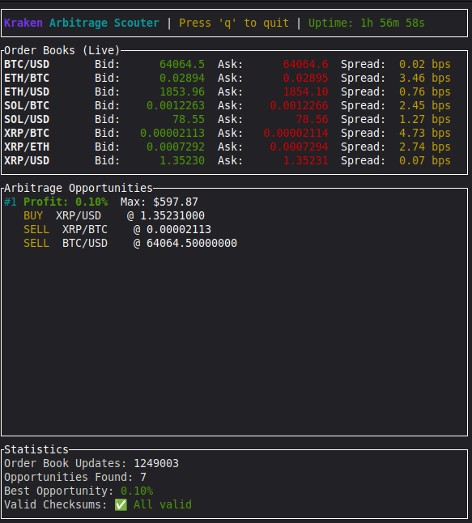

# Kraken Arbitrage Scouter

Real-time triangular arbitrage detection over Kraken's WebSocket v2 API, built in async Rust.

Maintains live, checksum-validated order books for multiple trading pairs and continuously scans currency triangles for arbitrage paths, sized against actual book depth rather than naive best bid/ask.

 

## What it does

- **Live market data via [kraken-ws-v2](https://github.com/zimmah/kraken-v2-ws)**: connection management, reconnection with backoff, subscriptions, and checksum-validated order books all come from the crate this project was extracted into. The scouter consumes its typed event stream; every book it computes on has already passed CRC32 validation, and resyncs after a checksum failure are automatic and visible in the UI.
- **Depth-aware opportunity sizing**: arbitrage paths are walked level by level (VWAP) through the book, working backward from the final leg to find the liquidity bottleneck. The result is a profit percentage _and_ the maximum executable volume, reflecting real market microstructure rather than a magic notional.
- **Live terminal UI**: flicker-free ratatui interface showing books, spreads, detected opportunities, and checksum status in real time.

## Architecture

Three independent Tokio tasks (WebSocket ingestion, arbitrage detection, TUI rendering) coordinate over shared state behind `Arc<RwLock>`, chosen for the read-heavy access pattern: the UI and detector read, only the WebSocket task writes.

```
┌─────────────────────────────────────────────────────────┐
│                    Main Application                     │
│                                                         │
│  ┌──────────────┐  ┌──────────────┐  ┌──────────────┐   │
│  │  WebSocket   │  │  Arbitrage   │  │   Terminal   │   │
│  │    Task      │  │   Detector   │  │   UI Task    │   │
│  │  (receive)   │  │   (compute)  │  │  (render)    │   │
│  └──────┬───────┘  └──────┬───────┘  └──────┬───────┘   │
│         │                 │                 │           │
│         └─────────────────┴─────────────────┘           │
│                           │                             │
│                ┌──────────▼──────────┐                  │
│                │  OrderBookManager   │                  │
│                │   (Arc<RwLock>)     │                  │
│                └─────────────────────┘                  │
└─────────────────────────────────────────────────────────┘
```

See [DESIGN.md](DESIGN.md) for the full design notes.

## Design decisions & tradeoffs

**Market data lives in a crate, arbitrage logic lives here.** The WebSocket connection, subscription handling, book maintenance, and checksum validation were extracted into [kraken-ws-v2](https://github.com/zimmah/kraken-v2-ws), which uses typed `thiserror` errors, an actor-owned connection with no locks, and deterministic replay tests. See its README for the design notes on reconnect semantics and checksum behavior. The scouter keeps what is specific to itself: path detection, sizing, and the TUI.

**Depth-aware sizing over fixed notionals.** More complex, but an arbitrage signal without a realistic executable size is noise. The detector reports what the book can actually absorb.

**`RwLock` over `Mutex`.** The workload is read-heavy: two readers (detector, UI), one writer (the market data task). Concurrent readers shouldn't block each other.

**A TUI over log lines.** Live market state is easier to reason about when you can see it.

**`anyhow` at the application boundary.** Ergonomic for an application binary; the library underneath exposes typed errors and this binary is free to flatten them.

**Top-10 depth per side.** Matches the checksum specification and covers realistically executable size; deep-book-only opportunities are rare and rarely fillable.

**Fees are deliberately not modeled.** This is a detection engine, not an execution system. It demonstrates the mechanics of real-time book maintenance and path detection; the reported edges are gross. Single-venue triangular arbitrage is not practically executable by retail after fees and latency anyway, which is exactly why this tool observes and does not trade.

## Building & running

Requires Rust 1.75+. TLS via `rustls`, so no OpenSSL needed.

```bash
git clone https://github.com/zimmah/arbitrage-scouter
cd arbitrage-scouter
cargo run --release
# 'q' or Ctrl+C to exit gracefully
```

Configuration lives in the `Config` struct in `main.rs`:

```rust
let config = Config {
    min_profit_bps: 10,              // 0.10% minimum edge
    detection_interval_ms: 1000,
    ui_refresh_interval_ms: 250,
};
```

## Sample output

```
┌────────────────────────────────────────────────────────────────────────┐
│ Kraken Arbitrage Scouter | Press 'q' to quit | Uptime: 2m 34s          │
└────────────────────────────────────────────────────────────────────────┘
┌─ Order Books (Live) ───────────────────────────────────────────────────┐
│ BTC/USD       Bid:    47234.5000  Ask:    47241.3000  Spread:  1.4 bps │
│ ETH/USD       Bid:     2456.7800  Ask:     2457.9200  Spread:  4.6 bps │
│ ETH/BTC       Bid:        0.0520  Ask:        0.0521  Spread:  1.9 bps │
└────────────────────────────────────────────────────────────────────────┘
┌─ Arbitrage Opportunities ──────────────────────────────────────────────┐
│ #1 Profit: 0.15%  Max: $1425.50                                        │
│    BUY  BTC/USD     @ 47241.30000000                                   │
│    BUY  ETH/BTC     @ 0.05203000                                       │
│    SELL ETH/USD     @ 2461.50000000                                    │
│                                                                        │
│ #2 Profit: 0.08%  Max: $892.30                                         │
│    BUY  ETH/USD     @ 2457.92000000                                    │
│    SELL ETH/BTC     @ 0.05199000                                       │
│    SELL BTC/USD     @ 47234.50000000                                   │
└────────────────────────────────────────────────────────────────────────┘
┌─ Statistics ───────────────────────────────────────────────────────────┐
│ Order Book Updates: 2847                                               │
│ Opportunities Found: 12                                                │
│ Best Opportunity: 0.23%                                                │
│ Valid Checksums: ✅ All valid                                          │
└────────────────────────────────────────────────────────────────────────┘
```



## How detection works

For each currency triangle (e.g. USD → BTC → ETH → USD), both path directions are evaluated:

1. Walk each leg through the order book at VWAP, not top-of-book price.
2. Work backward from the final leg to find the liquidity bottleneck across all three legs.
3. Report the edge in basis points together with the maximum executable amount.

Real opportunities on a single venue are rare and short-lived. That makes them a good correctness test: if the detector fires constantly, something is wrong.

## Testing

```bash
cargo test
```

Coverage here focuses on the scouter's own logic: profitable-path detection, no-opportunity rejection, and checksum-health bookkeeping. Order book invariants, checksum accuracy against Kraken's reference vector, and replay of captured traffic are tested in [kraken-ws-v2](https://github.com/zimmah/kraken-v2-ws), where that code lives. CI builds and runs the test suite on every push.

## Status & roadmap

The scouter is the reference application for [kraken-ws-v2](https://github.com/zimmah/kraken-v2-ws), the standalone crate its WebSocket and order book layer was extracted into. Development of connection handling, book maintenance, and checksum validation happens there, with typed errors, documented examples, and deterministic replay tests; the scouter stays a working demonstration of building on top of it.

## License

MIT, see [LICENSE](LICENSE).

_This tool observes markets; it does not execute trades, and nothing here is financial advice._
